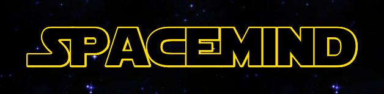

# Spacemind
A Mastermind game with a Star Wars theme.

## Table of Contents
[General Info](#general-info)

[Game Rules](#game-rules)

[Technologies](#technologies)

[Launch](#launch)

[License](#license)

## General Info
This game is a project made for the course *Systemutvecklingsprojek(IK086G)* autumn 2020. The program is written in C# on the .net platform with the GUI is written using Windows Platform Foundation(WPF). On the backend it uses a database to store data on players and their game results using Postgresql as a database manager. The game has a drag-and-drop interface to allow the player to drag a number of avatars onto the game board. There is also a sound player to play music from a list of sound files while the game runs. 

## Game Rules

### How to Play
The computer will create a secret code consisting of four avatars. The goal of the game is to guess the secret code in 10 tries or less. The player may drag any of the coloured pegs to the game board to make a consisting of four avatars, and then press the Guess button. The computer will provide feedback on the guess with four smaller pegs to the right, one for each avatar:

* A Green feedback peg means the avatar is the correct avatar and in the right position.
* A Yellow feedback peg means the avatar is the correct avatar but in the wrong position.
* A Black feedback peg means the avatar is neither the right avatar nor the correct position.

This will continue until you have spent all of the 10 guesses or until the code is cracked.

### Difficulty Levels
#### Easy
The secret code will consist of 4 avatars.
#### Medium
The secret code will consist of 6 avatars.
#### Hard
The secret code will consist of 8 avatars.

### Start Menu
#### Create Player
To create a new player, simply click “CREATE PLAYER”, type a name in the textbox, and then click “CREATE PLAYER”.
#### Choose Player
Back for more? To play with an already existing player, click “choose PLAYER”, select a player from the list, a difficulty setting, and then click “PLAY GAME”.
#### Highscore
This page will present the best 3 players of any category.
#### Game Rules
See a page of game rules for the game. 

## Technologies
The project is created with:
* .net Core version: 3.1
* C# version: 8.0
* postgresql version: 12.4(???)
* Npgsql version: 4.14
* PropertyChanged.Fody version: 3.2.9
* WpfAnimatedGif version: 2.0.0

## Launch
Build and run in Visual Studio 2019.

## License
No copyright infringement intended.

